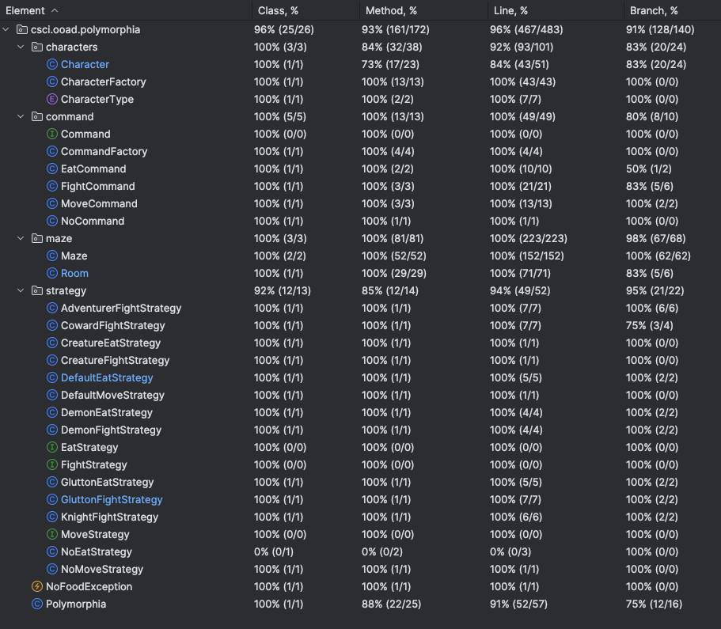

# OOAD Homework 7:
## Refactoring with Strategy and Command Patterns
#### (45 points)

TODO:
- If adventurers are in the room with the Demon, the Demon will fight the healthiest one
- If no adventurers are in the room, the Demon will move to a random neighboring room
- Use the Strategy Pattern to inject behavior into the Adventurer class so that we can create Characters that behave like our previous subclasses of Knight, Glutton, and Coward.
- Use the Strategy Pattern to do the same with Demon subclass of Creature.
- Use the Command Pattern to return the action to execute from the Strategy Pattern classes
- Use the Factory Pattern to create the Command objects

### Introduction
#### Team Members: 
Grace Ohlsen, Sierra Reschke and Nolan Brady 

#### Java Version: 21

#### Comments/Assumptions: 
We made the assumption that the flow of strategies would go fight, eat and move in terms of priority. All the tests passed therefore I think the logic stands.
We reworked the NoFood Exceptions to avoid having to pass the exception throwing up the method stack. This also passed in tests.
We also created strategies for different characters when there were variances in their movements as this seemed to be the cleanest approach to the different logic.

## Test Coverage

## Grading Rubric:

### Deductions

    NOTE: for this assignment you do NOT need to worry about method coverage and you do NOT need to submit a screenshot of the coverage

* Meaningful names for everything: variables, methods, classes, interfaces, etc. (1% off for each bad name, up to 10% total)
* No "magic" numbers or strings (1% off for each one, up to 10%)
* No System.out.println() calls anywhere in your main code – replace with logging (see below) or eliminate outright. 1% off for each System.out.println statement in src/main/java code.
* 1% deduction for each missing required addition to the README.md (game outputs, screenshots, diagrams)

### Method Construction Possible Deductions (max is listed under Required Capabilities)

Methods should be:
* "short" -- with very few exceptions all methods should fit on a screen using a readable font.
* well named (duh).
* properly denoted as instance methods vs. static methods (static methods don't reference the _this_ pointer).
* limited complexity (level of indentation due to control structures).
* not have comments that could be turned into just as readable code.

All of this can be achieved through functional decomposition of more complicated methods (see lecture on October 2nd).

## Game Extensions
* If adventurers are in the room with the Demon, the Demon will fight the healthiest one
* If no adventurers are in the room, the Demon will move to a random neighboring room

### Required Capabilities

* Use the Strategy Pattern to inject behavior into the Adventurer class so that we can create Characters that behave like our previous subclasses of Knight, Glutton, and Coward. (15 points)
* Use the Strategy Pattern to do the same with Demon subclass of Creature. (5 points)
* Use the Command Pattern to return the action to execute from the Strategy Pattern classes (20 points)
* Use the Factory Pattern to create the Command objects (5 points)

